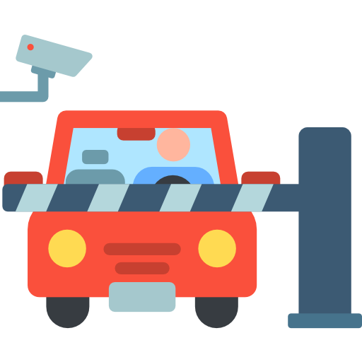

# GATEL
Controle de acesso de veículos em residenciais.

O sistema de automação de portaria de prédios, tem com objetivo, melhorar o fluxo e diminuir a burocracia, através de leitura de placa utilizando câmera(OCR), abertura automática de portões, e um sistema conectado na nuvem que gerencia todo o controle de entrada e saída de veículos, regras de acesso e muito mais.

#### Tecnologias
 * API - .NET Core
 * APP - Vue.js + Vuetify

